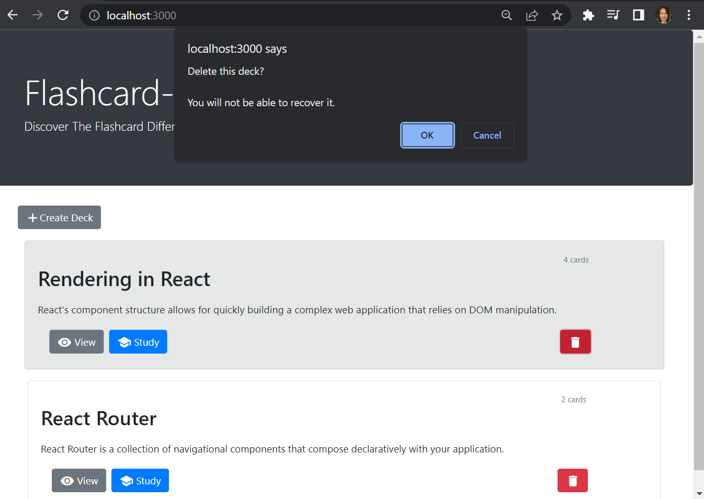
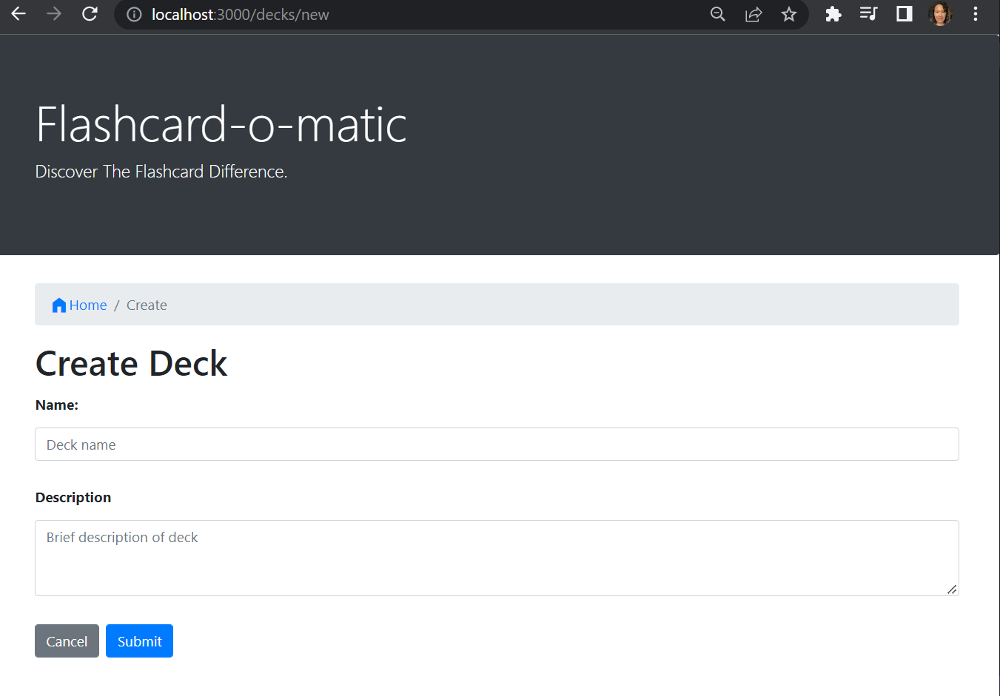
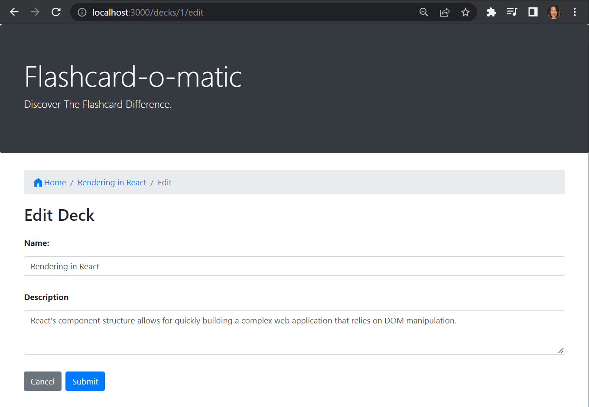
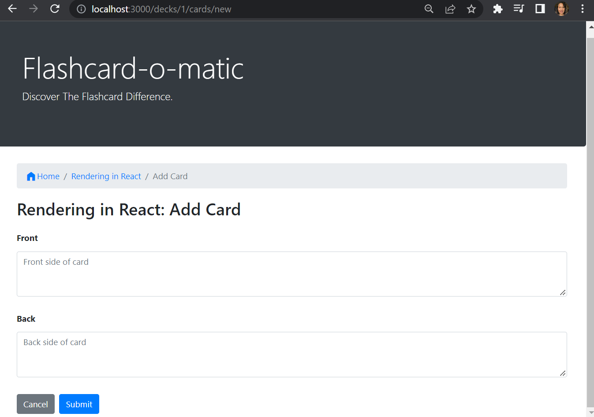
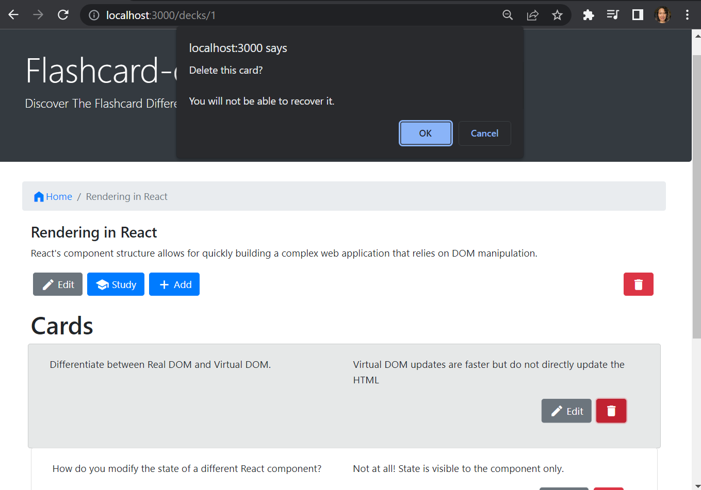
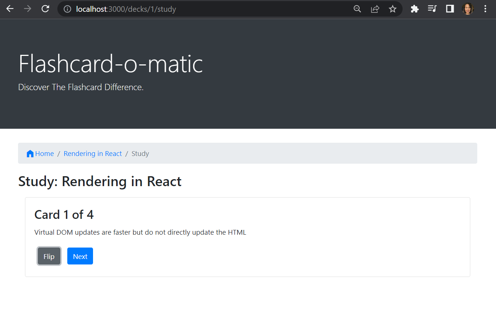
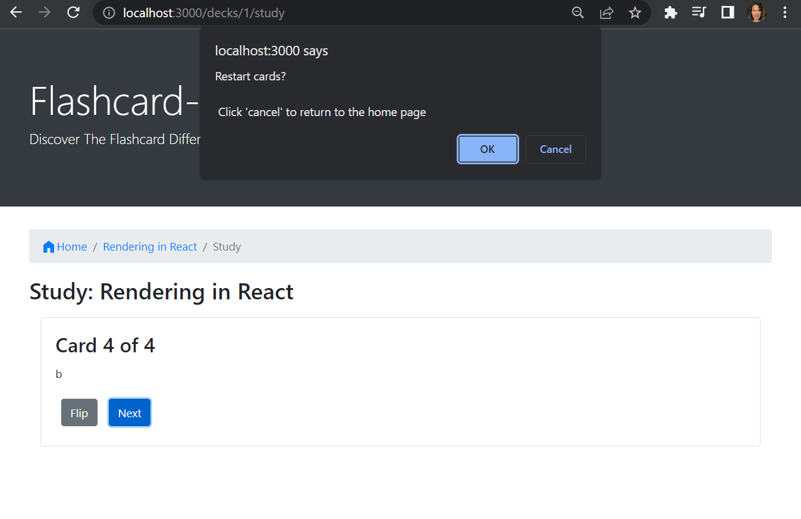
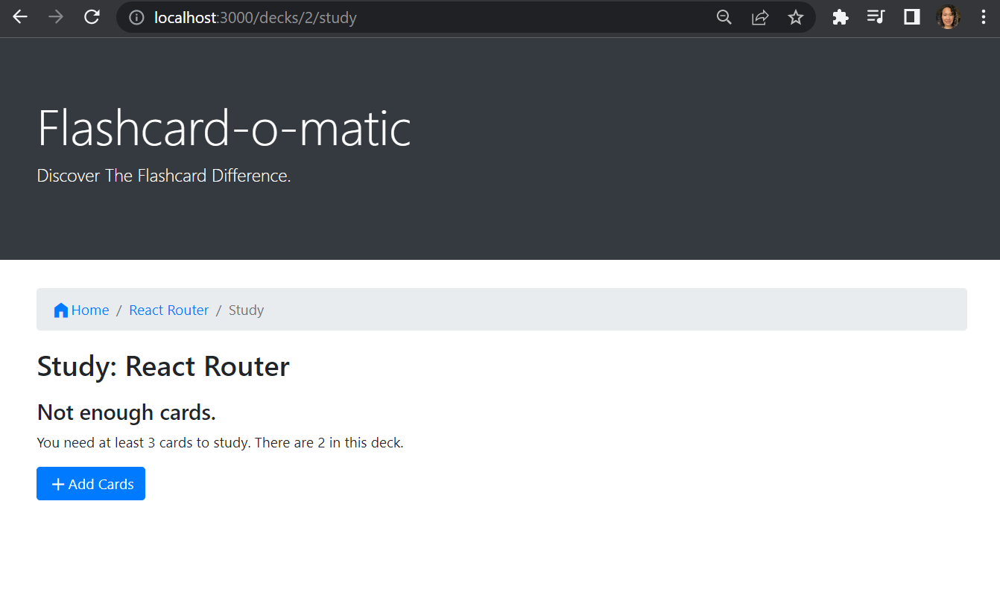

# Flashcard-o-matic

Flashcard-o-matic is a flashcard app built to help students study online.  Teachers may use this application to create decks of flashcards for the subjects they teach, and students will study the decks


## Getting Started

1. Install packages with `npm i`
2. Start application with `npm start`

 The `start` command will start two servers concurrently:

- An API server, powered by json-server, running on [API Server](http://localhost:5000)
- A React application running on [React App](http://localhost:3000)

### Running on Windows

If you are having problems running npm start on Windows, you may need to run the React client and server in separate terminals.

1. Open a terminal and run `npm run start:react` to start the react application.
2. Open another terminal and run `npm run start:server` to run the server.

## API

The API has two datasets used within the react app, `deck` and `cards`.

You can view all the data inside of the `data/db.json` file. Each data set can be accessed via a named property in this file. The following is a partial listing of the data in `data/db.json`:

```json
{
  "decks": [
    {
      "id": 1,
      "name": "...",
      "description": "..."
    }
  ],
  "cards": [
    {
      "id": 1,
      "front": "...",
      "back": "...",
      "deckId": 1
    }
  ]
}
```

### Decks

Each Deck is an object with the following shape:

```json
{
  "id": 1,
  "name": "Rendering in React",
  "description": "React's component structure allows for quickly building a complex web application that relies on DOM manipulation. "
}
```

A Deck represents a collection of flashcards, or simply cards.

### Cards

Each card is an object with the following shape:

```json
{
  "id": 1,
  "front": "Differentiate between Real DOM and Virtual DOM.",
  "back": "Virtual DOM updates are faster but do not directly update the HTML",
  "deckId": 1
}
```

Each card represents a flashcard with a *front* , where the question is displayed, and a *back*, where the answer can be found. A card also contains the *deckId*, which matches the card to the deck that the card belongs to.

## App Features

### Home

the Home screen is displayed at `/`.


It features the following:

1. A **Create Deck** button.
   - Clicking this button brings users to the create deck screen.
2. A list of decks which include:
   - The deck name, the number of cards, and a **View**, **Study**, and **Delete** button.
3. Clicking the **View** button brings the user to the Deck screen.
4. Clicking the **Study** button brings the user to the Study screen.
5. Clicking the **Delete** button shows a warning message before deleting the deck.



### Create Deck

The path to this screen should be /decks/new.  The users is directed here after clicking the **Create Deck** button on the Home screen



The Create Deck screen has the following features:

1. There is a breadcrumb navigation bar with a link to home `/` followed by the text `Create Deck` (i.e., `Home/Create Deck`).
2. A form is shown with the appropriate fields for creating a new deck.
   1. The **name** field is an `<input>` field of type text.
   2. The **description** field is a `<textarea>` field that can be multiple lines of text.
3. If the user clicks **Submit**, the user is taken to the Deck screen.
4. If the user clicks **Cancel**, the user is taken to the Home screen.

### View Deck

The Deck screen displays all of the information about a deck on the `/decks/:deckId` path.
The user is directed to this path after clicking the **View** button and the decks `id` value from the API is passed as a parameter.


The Deck screen has the following features:

1. There is a breadcrumb navigation bar with a link to home `/` followed by the name of the deck (e.g., `Home/React Router`).
• The screen includes the deck name (e.g., *"React Router"*) and deck description.
• The screen includes **Edit**, **Study**, **Add Cards**, and **Delete** buttons. Each button takes the user to a different destination, as follows:

| Button Clicked | Destination |
| -------------- | ---------------------------------------------------------------------------------------------- |
| Edit | Edit Deck Screen |
| Study | Study screen |
| Add Cards | Add Card screen |
| Delete | Shows a warning message before deleting the deck]( See the "Delete Card Prompt" section below) |

1. Each card in the deck:
   1. Is listed on the page under the "Cards" heading.
   2. Shows a question and the answer to the question.
   3. Has an Edit button that takes the user to the Edit Card screen when clicked.
   4. Has a Delete button that allows that card to be deleted.

#### Edit Deck

The Edit Deck screen allows the user to modify information on an existing deck. The path to this screen is `/decks/:deckId/edit`. The user is directed to this screen when clicking the **Edit** button on the Deck screen and the deck's `id` from the API is passed as a parameter.



The Edit Deck screen has the following features:

1. There is a breadcrumb navigation bar with a link to home `/`, followed by the name of the deck being edited, and finally the text *Edit Deck* (e.g., `Home/Rendering in React/Edit Deck`).
2. It displays the same form as the **Create Deck** screen, except it is pre-filled with information for the existing deck, which the user can edit and update on the form.
3. If the user clicks **Cancel**, the user is taken to the **Deck** screen.

#### Add Card

The Add Card screen allows the user to add a new card to an existing deck.  
It is displayed on the `/decks/:deckId/cards/new` path.The user is directed to this screen after clicking the **Add Card** button on the **Deck** screen.

The Add Card screen has the following features:



1. There is a breadcrumb navigation bar with a link to home `/`, followed by the name of the deck to which the cards are being added, and finally the text **Add Card** (e.g., `Home/React Router/Add Card`).
2. The screen displays the **React Router: Add Card** deck title.
3. A form is shown with the *"front"* and *"back"* fields for a new card. Both fields use a `<textarea>` tag that can accommodate multiple lines of text.
4. If the user clicks **Submit**, a new card is created and associated with the relevant deck. Then the form is cleared and the process for adding a card is restarted.
5. If the user clicks **Cancel**, the user is taken to the Deck screen.

#### Cards on the Deck Screen

Below the decks info, a list of cards is displayed.  

1. The text on the left side of the card has the information from the **front** side of the flashcard
2. The text on the right side of the card has the information form the **back** side of the flashcard
3. Below the text the **Edit Card** and **Delete** buttons are displayed

##### Edit Card

The Edit Card screen allows the user to modify information on an existing card.
The path to this screen is `/decks/:deckId/cards/:cardId/edit`.  The user is directed here after clicking on the **Edit Card** button from the **Deck** screen.  


The Edit Card screen has the following features:

• There is a breadcrumb navigation bar with a link to home `/`, followed by the name of the deck of which the edited card is a member, and finally the text *Edit Card :cardId* (e.g., `Home/Deck React Router/Edit Card 4`).
• It displays the same form as the *Add Card* screen, except it is pre-filled with information for the existing card that can be edited and updated.
• If the user clicks on either **Submit** or **Cancel**, the user is taken to the Deck screen

##### Delete Card Prompt

When the user clicks the Delete button associated with a card, a warning message is shown and the user can click **OK** or **Cancel**. If the user clicks **OK**, the card is deleted.



### Study

The Study screen is displayed at `/decks/:deckId/study.`


It features the following:

1. There is a breadcrumb navigation bar with links to home `/`, followed by the name of the deck being studied, and finally the text Study (e.g., `Home/Rendering In React/Study`).
2. The deck title (i.e., "Study: Rendering in React" ) is shown on the screen.
3. Cards are shown one at a time, front-side first.
4. A button at the bottom of each card "flips" it to the other side.
5. After flipping the card, the screen shows a **Next** button (*see the Next button section below*) to continue to the next card.
6. After the final card in the deck has been shown, a message (*see the Restart prompt section below*) is shown offering the user the opportunity to restart the deck.
   1. If the user does not restart the deck, they will return to the home screen.
7. Studying a deck with two or fewer cards will display a "Not enough cards" message (*see the "Not enough cards" section below*) and a button to add cards to the deck.

#### Next button

The Next button appears after the card is flipped.



#### Restart prompt

When all cards are finished, a message is shown and the user is offered the opportunity to restart the deck. If the user does not restart the deck, they return to the home screen.



#### Not enough cards

Studying a Deck with two or fewer cards will display a "Not enough cards" message and a button to add cards to the deck.



Clicking the **Add Cards** button should take the user to the Add Card screen
